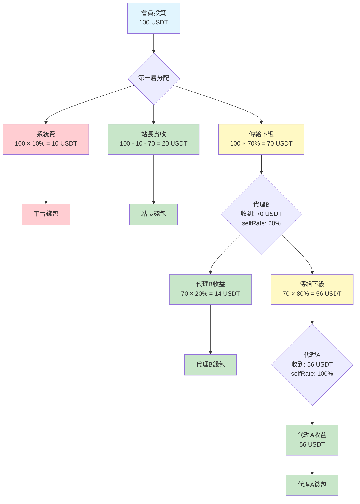

# 分潤模型說明

## 樹狀圖



## 最終分配結果

| 角色 | 金額 | 比例 |
|------|------|------|
| 平台 | 10 USDT | 10% |
| 站長 | 20 USDT | 20% |
| 代理B | 14 USDT | 14% |
| 代理A | 56 USDT | 56% |
| **總計** | **100 USDT** | **100%** |

## 計算公式

### 第一層（站長）
```
系統費 = 總金額 × systemFeeRate
傳給下級 = 總金額 × (1 - selfRate)
站長實收 = 總金額 - 系統費 - 傳給下級
         = 總金額 × selfRate - 系統費
```

### 後續層（代理）
```
保留 = 收到金額 × selfRate
傳給下級 = 收到金額 × (1 - selfRate)
```

## 代理樹結構

```
站長 (selfRate: 30%)
  └── 代理B (selfRate: 20%)
        └── 代理A (selfRate: 100%)
              └── 會員
```

## 資金流向

```
會員投資 100 USDT
    │
    ├──→ 平台: 10 USDT (系統費)
    │
    ├──→ 站長: 20 USDT (30% - 系統費)
    │
    └──→ 代理池: 70 USDT
              │
              ├──→ 代理B: 14 USDT (70 × 20%)
              │
              └──→ 代理A: 56 USDT (70 × 80%)
```
